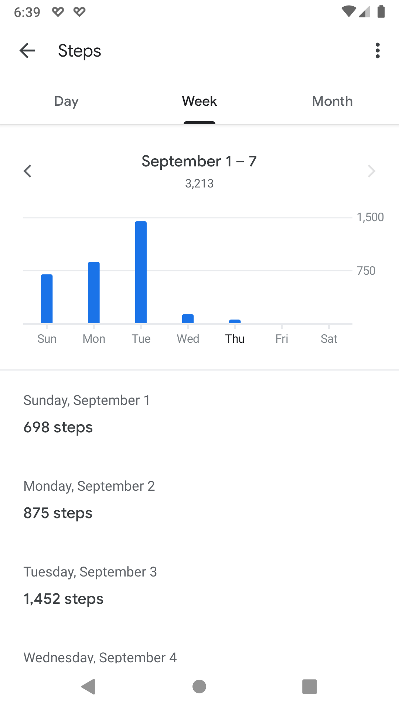
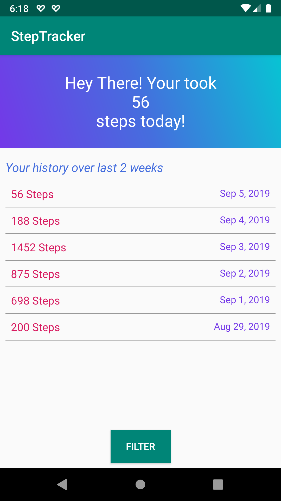

# Android Step Tracker using Google Fit
Step tracker Implementation using Google Fit API

# Summary
Here is simple implementation of Google Fit's History API integration. Application implements following features.
1. Google Fit History API
2. OAuth 2.0 
3. RecyclerView
4. Constraint Layout
5. Custom popups and Alertdialogs 

# Screenshots

Google Fit History             |  App implementation
:-------------------------:|:-------------------------:
 |  

# References
1. https://developers.google.com/fit/scenarios/read-daily-step-total
2. https://developers.google.com/fit/android/history
3. https://code.tutsplus.com/tutorials/google-fit-for-android-recording-api--cms-25855
4. https://code.tutsplus.com/tutorials/google-fit-for-android-history-api--cms-25856